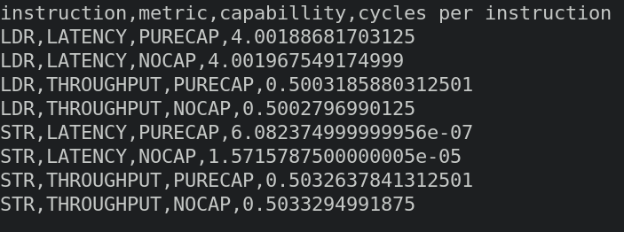
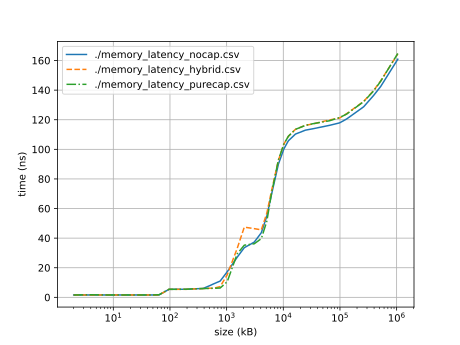

## Links and Resources:

- https://ctsrd-cheri.github.io/morello-early-performance-results/cover/index.html
- https://www.cheribsd.org/tutorial/23.11/benchmark/index.html
- https://capabilitiesforcoders.com/faq/index.html
- https://www.bazhenov.me/posts/paired-benchmarking/
- Neoverse N1
- https://www.brendangregg.com/perf.html

## Week 05.03.2025 - 12.03.2025

## Week 05.02.2025 - 12.02.2025

### TODOs:

- Add Latency Tests to CVTD, maybe LDP
- Test the assoaiated instructions as well to actually determine latency
- Try Polybench C
    - Compile with hybrid compiler
        - Done
    - Add some \_\_capability annotations
        - probably need to inline the macros for this? Code is quite macro heavy
    - Compile with purecap compiler
        - Done

### Challenges/Questions:

- What exactly should I test using Polybench? Time? Cycles? Instructions?
- What is PAPI?
- Where is the mythical Postgres CHERI mentioned in the programming manual?

## Week 30.01.2025 - 05.02.2025

### TODOs:

- Add Latency Tests to LD Instructions
- Add Tests for and find ASM eqivalents to:
    - cheri_address_get, cheri_base_get, cheri_length_get, cheri_offset_get, cheri_perms_get, cheri_tag_get
    - cheri_address_set, cheri_bounds_set, cheri_perms_and, cheri_tag_clear
- CVTD as they will most likely be used by hybrid

### Challenges/Questions:

- Testing Latency for LDP purecap is difficult. I can't find a good way to introduce a Data Dependency. If necessary, I could just test it in Hybrid Mode.

### Results:

- Added LDR_CAP, LDP_CAP Latency tests
- Consistent Latency of 4 cycles for all of them

| Instruction | Metric  | Capability | Cycles/Instruction | Instructions/Cycle  |
| ----------- | ------- | ---------- | ------------------ | ------------------- |
| LDR         | LATENCY | PURECAP    | 4.002747679312501  | 0.2498283879267046  |
| LDR_CAP     | LATENCY | PURECAP    | 4.003325177874999  | 0.24979234900193867 |
| LDP_CAP     | LATENCY | PURECAP    | 4.002923937312500  | 0.24981738740491385 |

## Week 23.01.2025 - 29.01.2025

### TODOs:

- Restructure Latency and throughput tests. Make it easier to add new ones.
- Cheri specific instructions

### Results:

- Changed test structure, split instructions.c file into nocap and purecap. Python script is now more configurable.
- Added LDR_CAP, LDP, LDP_CAP, STP, STP_CAP. Only Throughput so far.
- Interesting results when looking at STP and STP_CAP.

    - Results somewhat correspond with results discussed in https://ctsrd-cheri.github.io/morello-early-performance-results/performance-methodology/morello-microarchitectural-limitations.html

    | instruction | metric     | capabillity | cycles/instruction | instructions/cycle  |
    | ----------- | ---------- | ----------- | ------------------ | ------------------- |
    | LDR         | LATENCY    | PURECAP     | 4.003302436625     | 0.2497937679779832  |
    | LDR         | THROUGHPUT | PURECAP     | 0.5006907406875    | 1.9972408489657647  |
    | STR         | THROUGHPUT | PURECAP     | 0.503850282625     | 1.9847165606221735  |
    | LDAR        | THROUGHPUT | PURECAP     | 0.50074740225      | 1.9970148532108534  |
    | STLR        | THROUGHPUT | PURECAP     | 0.5013126245624999 | 1.9947632495246037  |
    | LDR_CAP     | THROUGHPUT | PURECAP     | 0.5009836686249999 | 1.9960730511327858  |
    | LDP         | THROUGHPUT | PURECAP     | 1.0011793094375    | 0.9988220796950321  |
    | LDP_CAP     | THROUGHPUT | PURECAP     | 1.0012018573750001 | 0.9987995853521974  |
    | STP         | THROUGHPUT | PURECAP     | 3.0023033595624997 | 0.3330776008410161  |
    | STP_CAP     | THROUGHPUT | PURECAP     | 6.003304391375     | 0.16657492854047326 |
    | LDR         | LATENCY    | NOCAP       | 4.003402525437499  | 0.24978752289984085 |
    | LDR         | THROUGHPUT | NOCAP       | 0.5006485694999999 | 1.9974090827797724  |
    | STR         | THROUGHPUT | NOCAP       | 0.5039982210625    | 1.9841339874014983  |
    | LDAR        | THROUGHPUT | NOCAP       | 0.500702752875     | 1.9971929338476178  |
    | STLR        | THROUGHPUT | NOCAP       | 0.501135059        | 1.995470047526649   |

## Week 16.01.2025 - 22.01.2025

### TODOs:

- Add more latency/throughput tests
- Test branch prediction

### Challenges/Questions

- Current test framewrok structure is too generalized, makes it harder to add new tests.
- Introducing Data Dependencies for Latency tests can be challenging (LDAR)
- CPYM/CPYP does not exist.
- LDR loading 64bit vs 128bit cap poitner might be different. (Look at STP LDP)

### Results:

- LDAR and STLR are in, seem pretty similar to the others

## Week 15.01.2025-22.01.2025

### TODOs:

- DO the other instructions
- Branching, capability branch, manually check and strip.

## Week 09.01.2025-15.01.2025

### TODOs:

- finish instruction latency tests
- look into how to test the branch prediction

### Questions:

- How should I plot this data?
- What other instructions need to be tested?

### Results:

- str and ldr cycle tests work! ignore str latency
  
- Purecap and Nocap show no difference (ldr 4 cycle latency)

## Week 01.01.2025 - 08.01.2025

### TODOs:

- Update memory latency tests for purecap
- Write instruction latency tests

### Challenges/Questions:

- As we are using purecap musl libc for purecap, would it make sense to also statically link musl libc for the hybrid binary, as to avoid accidentally measuring glibc vs musl libc perf differences?
- What about dynamic clock speeds?
- Why not just use perf? at least for cycles per instruction.
- Assembly is really hard. Especially if you don't know the ABI.
- The idea that could not be executed:
    - Use perf to measure cycles, orchestrated from a python script.
    - For each instruction, run main once with iteration = 0. Count the cycles = base_cycles.
    - Run main with x iterations. Count cycles again = total_instruction_cycles.
    - Get cycles per instruction by: total_instruction_cycles / iterations - base_cycles

### Results:

- Memory latency test now runs nocap, hybrid and purecap

## Week 4.12.2024 - 11.12.2024

### TODOs:

- See if purecap works now. If not, try the Hybrid-ABI.
- Visualization. I'm thinking of keeping the justfile as main orchestration, but running visualizations optionally via python.
- Read morello ISA
- Write Instruction Latency/Cycle tests (LDR, STR, LDAR, STLR, LDAXR, STLXR, PUSH, POP, PRFM )
- Research paired benchmarking. Discuss with supervisors.

### Challenges/Questions:

- cheri.h does not compile
- Where is vaddr_t?
- What is the significance of memory latency data? How could accuracy be improved?
- Does hybrid vs purecap make a difference?
- How do the instruction cycle tests work? How is clkspeed determined?

### Results:

- Got memory latency running on morello hybrid!
- Memory latency tests comparisons are pretty inconsistent. More precision/analysis needed.

## Week 27.11.2024 - 03.12.2024

### TODOs (not ordered):

- Run memory latency test on morello. Do they still work? Do results differ based on ABI/compiler?
- Find better way to orchestrate tests. Better Justfile? Rust? ZIG??
    - build two binaries, with cap or nocap
- Visualization. Possibly Python + Matplotlib, perhaps Rust if a different orchestration method is chosen.
- Read morello ISA, deepen understanding of relevant Instructions
- Write Instruction Latency/Cycle tests

### Challenges/Questions:

- clang-morello is barely documented, some clang args don't work
- could not find way to discern a cap binary from a nocap binary (tried file and llvm-readelf)
- "-mabi=purecap" does not compile. Issues with stdio.h/glibc.
- Compiling purecap/nocap binaries does not work? Resulting binaries stay the same

### Results:

- Got clang-morello working (Thank you Martin!)
- Preliminary run of memory latency test with caps
    - Still runs without problems
    - No easily visible differences, but needs more precise investigation
- Justfile updated to support purecap/nocap (but does not produce different binaries)
